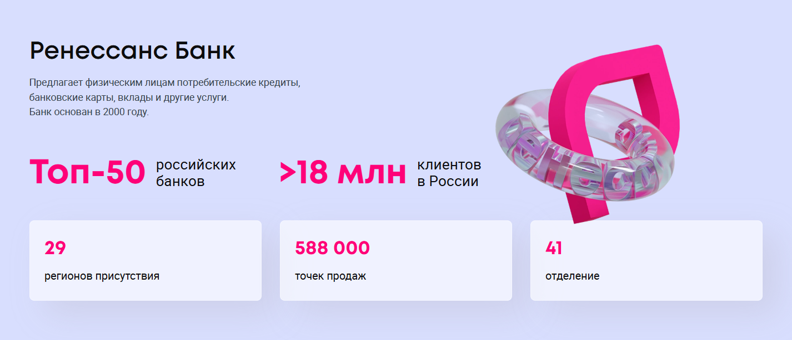

# Проект по автоматизации мобильного приложения ["Ренессанс Банк"](https://rencredit.ru).

## :pushpin: Содержание:

- <a href="#tools">Технологии и инструменты</a>
- <a href="#allure">Пример Allure-отчета</a>
- <a href="#video1">Пример видео с реального Андроид устройства</a>
- <a href="#video2">Пример видео с эмулятора</a>


<a id="tools"></a>
## :computer: Использованный стек технологий

<p align="center">
<a href="https://www.jetbrains.com/idea/" target="_blank">

</a>
<a href="https://github.com" target="_blank">

</a>
<a href="https://www.java.com" target="_blank">

</a>
<a href="https://selenide.org" target="_blank">

</a>
<a href="https://gradle.org" target="_blank">

</a>
<a href="https://junit.org/junit5/" target="_blank">

</a>
<a href="https://allurereport.org/" target="_blank">

</a>


</p>

- В данном проекте автотесты написаны на языке <code>Java</code> с использованием фреймворка для тестирования Selenide.
- В качестве сборщика был использован - <code>Gradle</code>.
- Реализован запуск автотестов на эмуляторе через Android Studio
- Реализован запуск автотестов на реальном Android устройстве
- Использованы фреймворки <code>JUnit 5</code> и [Selenide](https://selenide.org/).


##  Запуск автотестов
Запуск тестов на реальном Андроид устройстве:
```
 gradle clean local.properties
```


Запуск тестов на эмуляторе через Android Studio:
```
 gradle clean emulator.properties
```

<a id="allure"></a>
##  Пример [Allure-отчета](https://allurereport.org)

### Результат выполнения тестов

<p align="center">

</p>

<a id="video1"></a>
##  Пример видео выполнения тестов на реальном Android устройстве
____
<p align="center">
   
</p>

<a id="video2"></a>
## Пример видео выполнения тестов на эмуляторе
____
<p align="center">
   
</p>