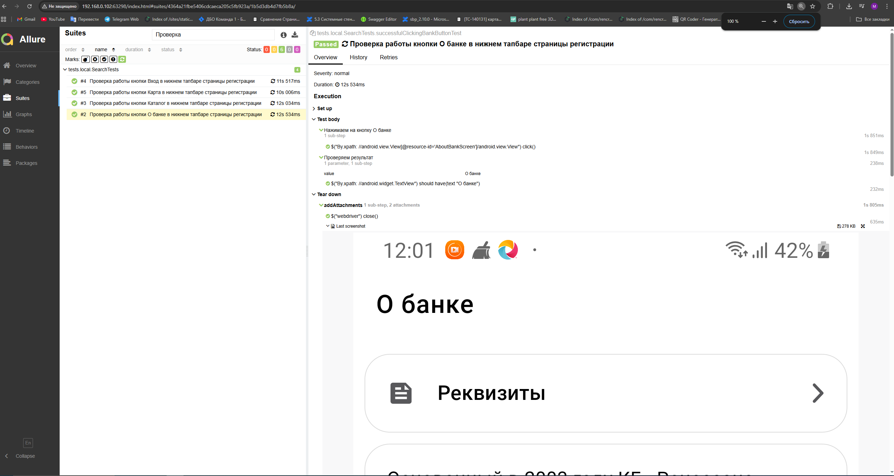
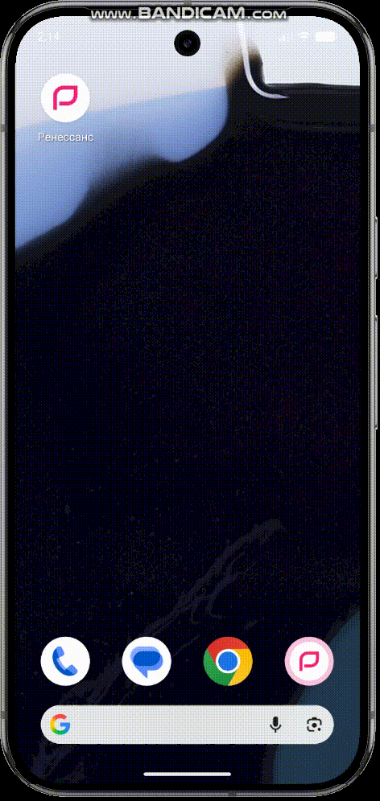

# Проект по автоматизации мобильного приложения ["Ренессанс Банк"](https://rencredit.ru).

## :pushpin: Содержание:

- <a href="#tools">Технологии и инструменты</a>
- <a href="#allure">Пример Allure-отчета</a>
- <a href="#video1">Пример Видео с реального Андроид устройства</a>
- <a href="#video2">Пример Видео с эмулятора</a>

<a id="tools"></a>
## :computer: Использованный стек технологий

<p align="center">


</p>

- В данном проекте автотесты написаны на языке <code>Java</code> с использованием фреймворка для тестирования Selenide.
- В качестве сборщика был использован - <code>Gradle</code>.
- Использованы фреймворки <code>JUnit 5</code> и [Selenide](https://selenide.org/).

- ```
## Запуск автотестов

### Локальный запуск тестов из терминала

Запуск на эмуляторе через Android Studio:
```bash 
 gradle clean local.properties
```

Запуск на реальном устройстве на Андроид:
```bash 
 gradle clean emulator.properties
```

<a id="allure"></a>
##  Пример [Allure-отчета](https://allurereport.org)


### Результат выполнения тестов

<p align="center">

</p>

<p align="center">

</p>

<a id="video1"></a>
## </a> Примеры видео выполнения тестов на Андроид
____
<p align="center">
   
</p>

<a id="video2"></a>
## </a> Примеры видео выполнения тестов на Эмуляторе
____
<p align="center">
   
</p>
